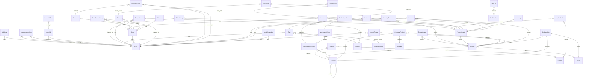

# ERD — آربایت

> خودکار از مدل‌های Django (`generate_data_model`).

```mermaid
erDiagram
  Address }o--|| User : "user"
  ImpersonationTicket }o--|| User : "target_user"
  ImpersonationTicket }o--|| User : "issued_by"
  Category }o--|| Category : "parent"
  ImportJob }o--|| User : "created_by"
  ImportJobRow }o--|| ImportJob : "import_job"
  PriceHistory }o--|| ProductVariant : "variant"
  PriceHistory }o--|| User : "changed_by"
  PriceRule }o--|| Supplier : "supplier"
  PriceRule }o--|| Category : "category"
  Product }o--|| Brand : "brand"
  Product }o--|| Category : "category"
  ProductImage }o--|| Product : "product"
  ProductSpecification }o--|| SpecificationDefinition : "definition"
  ProductSpecification }o--|| SpecificationValue : "value"
  ProductSpecification }o--|| Product : "product"
  ProductSpecification }o--|| ProductVariant : "variant"
  ProductVariant }o--|| Product : "product"
  SpecificationDefinition }o--|| Category : "category"
  SpecificationValue }o--|| SpecificationDefinition : "definition"
  SupplierProduct }o--|| Supplier : "supplier"
  SupplierProduct }o--|| ProductVariant : "variant"
  Cart }o--|| User : "user"
  Cart }o--|| Coupon : "coupon"
  Cart }o--|| ShippingMethod : "shipping_method"
  CartItem }o--|| Cart : "cart"
  CartItem }o--|| ProductVariant : "variant"
  CouponUsage }o--|| Coupon : "coupon"
  CouponUsage }o--|| User : "user"
  CouponUsage }o--|| Order : "order"
  Order }o--|| User : "user"
  OrderItem }o--|| Order : "order"
  OrderItem }o--|| ProductVariant : "variant"
  OrderItemUnit }o--|| OrderItem : "order_item"
  OrderStatusHistory }o--|| Order : "order"
  OrderStatusHistory }o--|| User : "changed_by"
  Payment }o--|| Order : "order"
  PaymentReceipt }o--|| Payment : "payment"
  PaymentReceipt }o--|| User : "user"
  PaymentReceipt }o--|| User : "reviewed_by"
  Return }o--|| Order : "order"
  ReturnItem }o--|| Return : "return_request"
  ReturnItem }o--|| OrderItem : "order_item"
  Shipment ||--|| Order : "order"
  Inventory ||--|| ProductVariant : "variant"
  InventoryTransaction }o--|| ProductVariant : "variant"
  InventoryTransaction }o--|| User : "user"
  CampaignProduct }o--|| Campaign : "campaign"
  CampaignProduct }o--|| Product : "product"
  CampaignProduct }o--|| Category : "category"
  Favorite }o--|| User : "user"
  Favorite }o--|| Product : "product"
  Favorite }o--|| ProductVariant : "variant"
  ProductReview }o--|| Product : "product"
  ProductReview }o--|| User : "user"
  SeoMetadata ||--|| Category : "category"
  SeoMetadata ||--|| Brand : "brand"
  SeoMetadata ||--|| Product : "product"
  AdminActivityLog }o--|| User : "user"
  SmsLog }o--|| SmsTemplate : "template"
```
